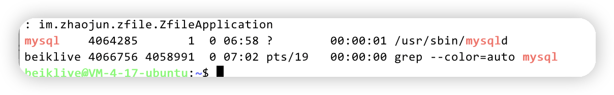
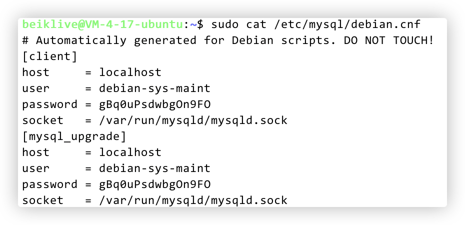
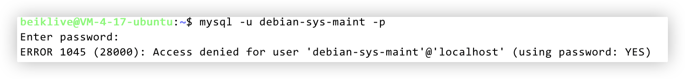
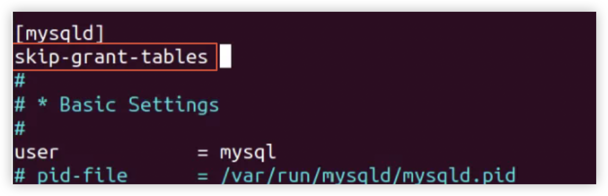

## (桌面版)创建快捷方式

### 进入图标文件目录
```bash
$ cd /usr/share/applications
```
### 创建图标文件
```bash
$ sudo vim myapp.desktop
```
### 输入图标相关信息
```bash
[Desktop Entry]
Encoding=UTF-8      #应用名称为中文时需要添加此行
Name=AutoScript     # 应用名称，配置完成后图标会显示为此处设置的名字
Comment=to start my app   #应用的解释信息
Exec=/home/ubuntu/tools/myscript.sh    #应用或者脚本的启动命令或目录
Icon=/home/ubuntu/tools/ICON/picacomic_2.png    #应用图标，不要使用ico格式
Terminal=true          # 启动命令行程序时是否显示終端
StartupNotify=true      # 启动通知
Type=Application        # 类型
Categories=Application; # 分类
```


## Samba配置

### 安装

```bash
sudo apt-get install samba samba-common
```
### 设置共享目录

```bash
mkdir /home/beiklive/share
sudo chmod 777 /home/beiklive/share
```
### 添加用户

```bash
sudo smbpasswd -a beiklive
```
### 修改配置文件

```bash
sudo vim /etc/samba/smb.conf
```

尾部添加

```
[share]
comment = share folder
browseable = yes
path = /home/beiklive/share
create mask = 0700
directory mask = 0700
valid users = beiklive
force user = beiklive
force group = beiklive
public = yes
available = yes
writable = yes
```
### 重启

```bash
sudo service smbd restart
```


## 使用systemctl启动服务

### 创建service文件
```shell
sudo vim /lib/systemd/system/xxx.service
```
### 写入内容
```
[Unit]
Description=fraps service
After=network.target syslog.target
Wants=network.target

[Service]
Type=simple
#启动服务的命令,使用绝对路径， 此处以frp为例
ExecStart=/your/path/frps -c /your/path/frps.ini

[Install]
WantedBy=multi-user.target
```
### 启动
```shell
sudo systemctl start xxx
```
### 打开自启动
```
sudo systemctl enable xxx
```

* 重启应用 `sudo systemctl restart xxx`

* 停止应用 `sudo systemctl stop xxx`

* 查看应用的日志 `sudo systemctl status xxx`


### 其他服务后台运行方法
[https://blog.csdn.net/x7418520/article/details/81077652](https://blog.csdn.net/x7418520/article/details/81077652)

## Mysql安装配置

#### 卸载

```bash
sudo apt purge mysql-*
sudo rm -r /etc/mysql
sudo rm -r /var/lib/mysql
sudo apt autoremove
sudo apt autoclean
```

#### 安装

```bash
sudo apt-get update #更新软件源
sudo apt-get install mysql-server -y
sudo apt install mysql-client -y
sudo apt install libmysqlclient-dev -y
```

保证以上步骤无报错

#### 检查是否安装成功

```bash
ps -ef | grep mysql 
```



#### 使用默认账户登录

```bash
sudo cat /etc/mysql/debian.cnf
```



```bash
mysql -u debian-sys-maint -p
```


如果登录报错



##### 1.设置允许无密码登录

```bash
sudo vim /etc/mysql/mysql.conf.d/mysqld.cnf
```

在 `[mysqld]`下添加

```
skip-grant-tables
```



##### 2.重启 MySQL

```bash
service mysql restart
```

##### 3.登录 Mysql

```bash
mysql -u root -p   # 输入密码时直接回车就行
```

##### 4.重新设置root账户密码

```mysql
# 以下都是在 mysql 的命令行中执行
use mysql;
flush privileges;
UPDATE user SET authentication_string='' WHERE user='root';
flush privileges;
alter user 'root'@'localhost' identified with mysql_native_password by 'password';
quit;
```

##### 5.重启mysql

首先删除第一步中加入到 mysqld.cnf的那条语句

然后重启 mysql 服务

```bash
service mysql restart
```

##### 6.使用修改后的账号密码登录

```bash
mysql -u root -p
```


## Linux安装高版本gcc,g++
### 添加相应的源
```bash
sudo add-apt-repository ppa:ubuntu-toolchain-r/test
```
### 更新软件源
```bash
sudo apt-get update
```
### 安装
```bash
sudo apt-get install gcc-11 g++-11
```


## 终端特殊显示
### 颜色修改

使用： `print("\033[91mThis is red text\033[0m")`
重置代码为 `\033[0m`

| 颜色 | 前景 | 背景 |
|:-:|:-:|:-:|
| Default | \033[39m | \033[49m |
| Black | \033[30m | \033[40m |
| Dark red | \033[31m | \033[41m |
| Dark green | \033[32m | \033[42m |
| Dark yellow (Orange-ish) | \033[33m | \033[43m |
| Dark blue | \033[34m | \033[44m |
| Dark magenta | \033[35m | \033[45m |
| Dark cyan | \033[36m | \033[46m |
| Light gray | \033[37m | \033[47m |
| Dark gray | \033[90m | \033[100m |
| Red | \033[91m | \033[101m |
| Green | \033[92m | \033[101m |
| Orange | \033[93m | \033[103m |
| Blue | \033[94m | \033[104m |
| Magenta | \033[95m | \033[105m |
| Cyan | \033[96m | \033[106m |
| White | \033[97m | \033[107m |

### 终端清空
```C++
std::cout << "\033c";
```

## mac安装brew
```bash
/bin/zsh -c "$(curl -fsSL https://gitee.com/cunkai/HomebrewCN/raw/master/Homebrew.sh)"
```