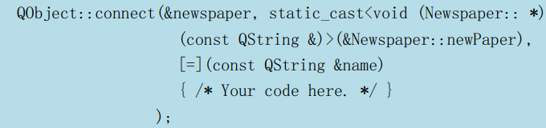

#   

# 信号与槽

只有继承了 `QObject`类的类，才具有信号槽的能力。

Qt 5 中，任何成员函数、static 函数、全局函数和 Lambda 表达式都可以作为槽函数。

## Q_OBJECT

凡是 `QObject` 类（不管是直接子类还是间接子类），都应该在第一行代码写上 `Q_OBJECT`。

不管是不是使用信号槽，都应该添加这个宏。这个宏的展开将为我们的类提供信号槽机制、国际化机制以及 Qt 提供的不基于 C++ RTTI的反射能力。

## emit

emit 是 Qt 对 C++ 的扩展，是一个关键字（其实也是一个宏）。emit 的含义是发出，也就是发出信号。感兴趣的接收者会关注这个信号，当接收者连接这个信号时，就可以通过槽函数获得实际值。这样就完成了数据从发出者到接收者的一个转移。

## 自定义信号槽需要注意的事项

- 发送者和接收者都需要是 QObject 的子类（当然，槽函数是全局函数、Lambda表达式等无需接收者的时候除外）；
- 使用 signals 标记信号函数，信号是一个函数声明，返回 void，不需要实现函数代码
- 槽函数是普通的成员函数，作为成员函数，会受到 public、private、protected 的影响
- 使用 emit 在恰当的位置发送信号；
- 使用 QObject::connect()函数连接信号和槽
- 任何成员函数、static 函数、全局函数和 Lambda 表达式都可以作为槽函数 

## 信号槽的更多用法

* **一个信号可以和多个槽相连**

    如果是这种情况，这些槽会一个接一个的被调用，但是它们的调用顺序是不确定的。

* **多个信号可以连接到一个槽**

    只要任意一个信号发出，这个槽就会被调用。

* **一个信号可以连接到另外的一个信号**

    当第一个信号发出时，第二个信号被发出。除此之外，这种信号-信号的形式和信号-槽的形式没有什么区别。

* **槽可以被取消链接**

    这种情况并不经常出现，因为当一个对象 delete 之后，Qt 自动取消所有连接到这个对象上面的槽。

* **使用 Lambda 表达式**

    在使用 Qt 5 的时候，能够支持 Qt 5 的编译器都是支持 Lambda 表达式的。
    我们的代码可以写成下面这样：

在连接信号和槽的时候，槽函数可以使用 Lambda 表达式的方式进行处理。