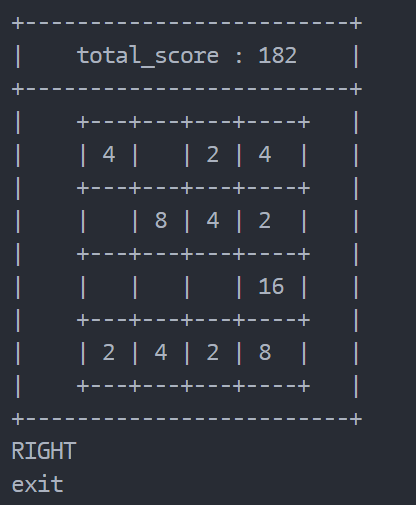

## 控制台2048


!!! note
    头文件`tabulate/table.hpp`地址：[https://github.com/p-ranav/tabulate](https://github.com/p-ranav/tabulate)

```c title="main.cpp" linenums="1"
#include "tabulate/table.hpp"

#include <unistd.h>
#include <string>
#include <termio.h>
#include <stdlib.h>
using namespace tabulate;
using namespace std;

const unsigned char CTRL_KEY = 'q';
const unsigned char LEFT = 'a';
const unsigned char RIGHT = 'd';
const unsigned char DOWN = 's';
const unsigned char UP = 'w';
const int MAXPOINT = 128;

int table1024[4][4] = {0};
int totalscore = 0;

int getch(void)
{
    int ch;
    struct termios tm, tm_old;
    tcgetattr(STDIN_FILENO, &tm);
    tm_old = tm;
    tm.c_lflag &= ~(ICANON | ECHO);
    tcsetattr(STDIN_FILENO, TCSANOW, &tm);
    ch = getchar();
    tcsetattr(STDIN_FILENO, TCSANOW, &tm_old);
    return ch;
}

void clearS()
{
#ifdef __linux__
    std::cout << "\033c";
#else
    system("cls");
#endif
}

std::string tableTrans(int a)
{
    return (a == 0 ? " " : to_string(a));
}

void tableformat(int score, int table[][4])
{
    clearS();
    Table title_score;
    title_score.add_row({"total_score : " + to_string(score)});
    title_score[0].format().font_align(FontAlign::center).width(25);

    Table styled_table;
    styled_table.add_row({tableTrans(table[0][0]), tableTrans(table[0][1]), tableTrans(table[0][2]), tableTrans(table[0][3])});
    styled_table.add_row({tableTrans(table[1][0]), tableTrans(table[1][1]), tableTrans(table[1][2]), tableTrans(table[1][3])});
    styled_table.add_row({tableTrans(table[2][0]), tableTrans(table[2][1]), tableTrans(table[2][2]), tableTrans(table[2][3])});
    styled_table.add_row({tableTrans(table[3][0]), tableTrans(table[3][1]), tableTrans(table[3][2]), tableTrans(table[3][3])});

    title_score.add_row({styled_table});
    title_score[1].format().font_align(FontAlign::center);
    std::cout << title_score << std::endl;
}

int getRandomPos()
{
    int r = rand() % 4;
    return r;
}

void ScoreSet(int var)
{
    if (var <= MAXPOINT && var > 0)
    {
        totalscore += var;
    }
    else
    {
        totalscore = 0;
    }
}

void clearMax(int x, int y, int table[][4])
{
    if (table[x][y] == MAXPOINT)
    {
        table[x][y] = 0;
    }
}

bool genElem(int table[][4])
{
    int i = getRandomPos(), j = getRandomPos();
    int flag = 0;
    for (int i = 0; i < 4; i++)
    {
        for (int j = 0; j < 4; j++)
        {
            if (table[i][j] == 0)
            {
                flag = 1;
            }
        }
    }
    if (flag == 0)
    {
        return false;
    }
    while (table[i][j] != 0)
    {
        i = getRandomPos();
        j = getRandomPos();
    }
    table[i][j] = (rand() % 2) * 2 + 2;
    return true;
}

void reset(int table[][4])
{
    for (int i = 0; i < 4; i++)
    {
        for (int j = 0; j < 4; j++)
        {
            table[i][j] = 0;
        }
    }
    ScoreSet(-1);
}

void MoveElemToLeft(int table[][4])
{
    int loopc = 3;
    while (loopc--)
    {
        for (int i = 0; i < 3; i++)
        {
            for (int j = 0; j < 4; j++)
            {
                clearMax(j, i, table);
                if (table[j][i] == 0)
                {
                    table[j][i] = table[j][i + 1];
                    table[j][i + 1] = 0;
                }
                else if (table[j][i] == table[j][i + 1])
                {
                    ScoreSet(table[j][i]);
                    table[j][i] += table[j][i + 1];
                    table[j][i + 1] = 0;
                }
            }
        }
    }
}

void MoveElemToRight(int table[][4])
{
    int loopc = 3;
    while (loopc--)
    {
        for (int i = 3; i > 0; i--)
        {
            for (int j = 0; j < 4; j++)
            {
                clearMax(j, i, table);
                if (table[j][i] == 0)
                {
                    table[j][i] = table[j][i - 1];
                    table[j][i - 1] = 0;
                }
                else if (table[j][i] == table[j][i - 1])
                {
                    ScoreSet(table[j][i]);
                    table[j][i] += table[j][i - 1];
                    table[j][i - 1] = 0;
                }
            }
        }
    }
}

void MoveElemToUp(int table[][4])
{
    int loopc = 3;
    while (loopc--)
    {
        for (int i = 0; i < 3; i++)
        {
            for (int j = 0; j < 4; j++)
            {
                clearMax(j, i, table);
                if (table[i][j] == 0)
                {
                    table[i][j] = table[i + 1][j];
                    table[i + 1][j] = 0;
                }
                else if (table[i][j] == table[i + 1][j])
                {
                    table[i][j] += table[i + 1][j];
                    table[i + 1][j] = 0;
                    ScoreSet(table[i][j]);
                }
            }
        }
    }
}

void MoveElemToDown(int table[][4])
{
    int loopc = 3;
    while (loopc--)
    {
        for (int i = 3; i > 0; i--)
        {
            for (int j = 0; j < 4; j++)
            {
                clearMax(j, i, table);
                if (table[i][j] == 0)
                {
                    table[i][j] = table[i - 1][j];
                    table[i - 1][j] = 0;
                }
                else if (table[i][j] == table[i - 1][j])
                {
                    table[i][j] += table[i - 1][j];
                    table[i - 1][j] = 0;
                    ScoreSet(table[i][j]);
                }
            }
        }
    }
}

void changeGap(int mode, int table[][4])
{
    switch (mode)
    {
    case 0:
        MoveElemToLeft(table);
        break;
    case 1:
        MoveElemToRight(table);
        break;
    case 2:
        MoveElemToDown(table);
        break;
    case 3:
        MoveElemToUp(table);
        break;
    default:
        break;
    }

    if (genElem(table))
    {
        genElem(table);
        tableformat(totalscore, table);
    }
    else
    {
        reset(table);
        tableformat(totalscore, table);
    }
}

int main()
{
    char a;
    tableformat(0, table1024);

    while (1)
    {
        switch (a = getch())
        {
        case LEFT:
            changeGap(0, table1024);
            std::cout << "LEFT" << std::endl;
            break;
        case RIGHT:
            changeGap(1, table1024);
            std::cout << "RIGHT" << std::endl;
            break;
        case DOWN:
            changeGap(2, table1024);
            std::cout << "DOWN" << std::endl;
            break;
        case UP:
            changeGap(3, table1024);
            std::cout << "UP" << std::endl;
            break;
        case CTRL_KEY:
            std::cout << "exit" << std::endl;
            return 0;
        default:
            tableformat(totalscore, table1024);
            std::cout << a << std::endl;
            break;
        }
    }
}
```
