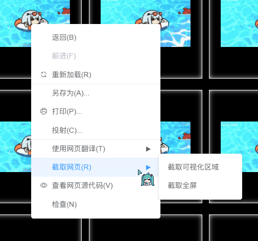
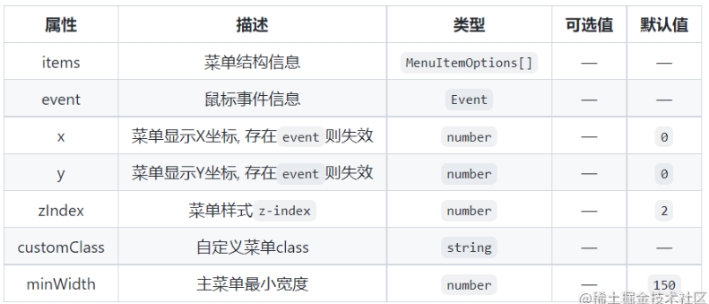
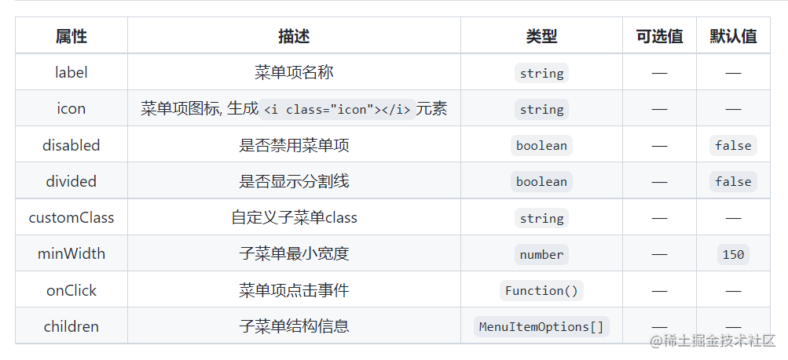

# VUE学习

## 重写右键菜单

### 安装

```bas
npm install vue-contextmenujs
```

或

```bash
yarn add vue-contextmenujs
```

### 使用

```VUE
import Contextmenu from "vue-contextmenujs"
Vue.use(Contextmenu);
```

### 代码

```VUE
<template>
  <div style="width:100vw;height:100vh" @contextmenu.prevent="onContextmenu"></div>
</template>

<script>
import Vue from 'vue'
import Contextmenu from "vue-contextmenujs"
Vue.use(Contextmenu);
export default {
  methods: {
    onContextmenu(event) {
      this.$contextmenu({
        items: [
          {
            label: "返回(B)",
            onClick: () => {
              this.message = "返回(B)";
              console.log("返回(B)");
            }
          },
          { label: "前进(F)", disabled: true },
          { label: "重新加载(R)", divided: true, icon: "el-icon-refresh" },
          { label: "另存为(A)..." },
          { label: "打印(P)...", icon: "el-icon-printer" },
          { label: "投射(C)...", divided: true },
          {
            label: "使用网页翻译(T)",
            divided: true,
            minWidth: 0,
            children: [{ label: "翻译成简体中文" }, { label: "翻译成繁体中文" }]
          },
          {
            label: "截取网页(R)",
            minWidth: 0,
            children: [
              {
                label: "截取可视化区域",
                onClick: () => {
                  this.message = "截取可视化区域";
                  console.log("截取可视化区域");
                }
              },
              { label: "截取全屏" }
            ]
          },
          { label: "查看网页源代码(V)", icon: "el-icon-view" },
          { label: "检查(N)" }
        ],
        event, // 鼠标事件信息
        customClass: "custom-class", // 自定义菜单 class
        zIndex: 3, // 菜单样式 z-index
        minWidth: 230 // 主菜单最小宽度
      });
      return false;
    }
  }
};
</script>
```

### 效果图



!!! note ""
	MenuOptions 菜单属性
	
	MenuItemOptions 选项属性
	
