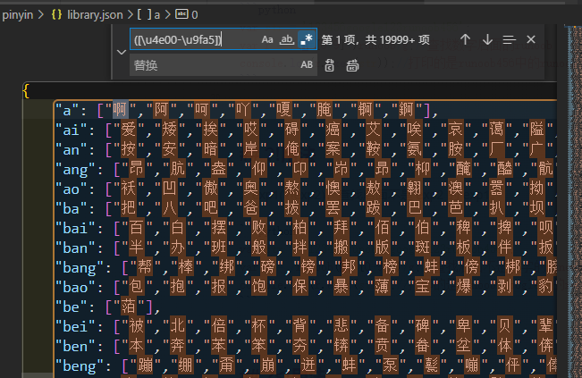

#  


# 正则表达式中?=、?＜=、?!、?＜!的使用区别

## ？=用法

> exp1(?=exp2)：查找exp1后面是exp2的exp1。

```python
var str = '123456runoob123runoob456';
var r = /runoob(?=[\d+])/g;//查找数字前面的runoob
console.log(r.exec(str));//打印的是runoob123中的runoob
```


## ？<=用法

> (?<=exp2)exp1：查找 exp1前面是exp2的exp1。

```python
var str = '123456google123runoob456';
var r = /(?=[0-9]+)runoob/g;//查找数字后面的runoob
console.log(r.exec(str));//打印的是runoob456中的runoob
```


## ?!用法

> exp1(?!exp2)：查找后面不是 exp2 的 exp1。

```python
var str = '123456runoob-google123runoob456';
var r = /runoob(?！[0-9]+)/g;//查找后面不是数字的runoob
console.log(r.exec(str));//打印的是runoob-google中的runoob
```


## ?<!用法

>  (?<!exp2)exp1：查找 exp1前面不是exp2的exp1。

```python
var str = '123456runoob-googlerunoob456';
var r = /(?<！[0-9]+)runoob/g;//查找前面不是数字的runoob
console.log(r.exec(str));//打印的是googlerunoob中的runoob
```

# 匹配汉字
> `([\u4e00-\u9fa5])`


